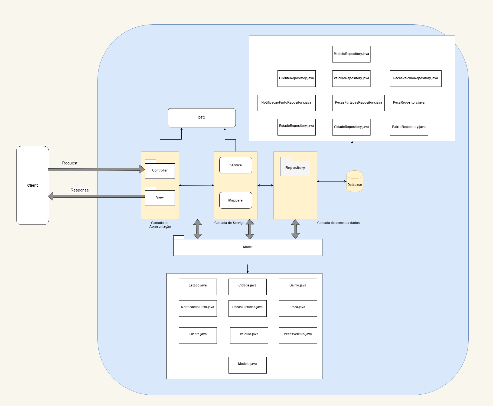

<h1 align="center">1ª Entrega - CHALLENGE SPRINT - Microservice and Web Engineering</h1>
<h1 align="center">Equipe Falcon</h1>

a) Criar um desenho com a arquitetura lógica da aplicação (Modelos, camada de acesso a dados, camada de serviço e camada de apresentação).

b) Criação de projeto Web Application por meio de Spring MVC, Maven, persistência em banco de dados relacional (CRUD) com JPA, conforme instruções e projetos criados.

https://start.spring.io/

c) Criar estrutura de packages identificadas por artefatos: model, controller, repository e config, conforme desenho arquitetural proposto na etapa a.

d) Construir as classes relacionadas a Entidades de Persistência (mapeamento objeto relacional/ORM) usando as anotações @Entity, @Id e @GeneratedValue. Escopo: criar Entidades de Persistência para todas as tabelas identificadas na 1ª entrega da disciplina Programming and Database Management.

e) Construir as classes Repository relacionadas às Entidades de Persistência.

Instruções de entrega:

- O projeto deve compactado e entregue na área aberta para o Chalenge Sprint no portal da FIAP por somente um aluno ou aluna do grupo.

- O projeto deve estar disponível em Github em todos os membros do grupo.

